# 🧪 Laboratorio VRRP — Grupo 8 (paso a paso)

**Asignatura:** Gestión Operativa y Seguridad en Redes (GOYS) — UTN FR La Plata
**Grupo:** 8
**Simulador:** GNS3 · **MikroTik CHR 7.21 (RouterOS 7)** · hosts Alpine (Docker)
**Guía base:** [`laboratorio-vrrp.md`](laboratorio-vrrp.md)
**Inspirado en:** [Router Redundancy — VRRP Mikrotik (Step by Step)](https://youtu.be/h_r9FtR8ZUk) · Arawi Network Consulting

> 📌 Este documento es el **registro de ejecución** del laboratorio VRRP del Grupo 8: el orden en que lo hicimos, los comandos exactos que usamos y —lo más importante— **qué obtuvimos en cada paso**, acompañado de la captura de pantalla correspondiente.
>
> Todas las figuras están en `goys-vrrp-grupo08/images/` y se insertan justo después del paso que ilustran.

---

## Integrantes

| Integrante | Legajo |
|------------|--------|
| Ulises Mateo Bucchino | 33326 |
| Valentín Garzaniti | 32547 |
| Jano Stratakis | 30765 |
| Sofia Raggi | 31532 |

---

## 1. Objetivos

Al terminar el laboratorio, como grupo fuimos capaces de:

1. **Configurar** VRRP entre dos routers MikroTik (VRID, prioridad, IP virtual).
2. **Explicar** el rol de la IP virtual y por qué el host nunca cambia su gateway.
3. **Verificar** el failover: bajar el master y comprobar que el backup toma el gateway.
4. **Entender** la limitación: VRRP cubre la caída del *gateway*, no la del *uplink*.

---

## 2. Paso 0 — Armado de la topología en GNS3

Armamos la topología del enunciado: una nube que hace de Internet (con DHCP + NAT), dos routers MikroTik CHR en paralelo entre la WAN y la LAN, y dos hosts Alpine del lado de la LAN.

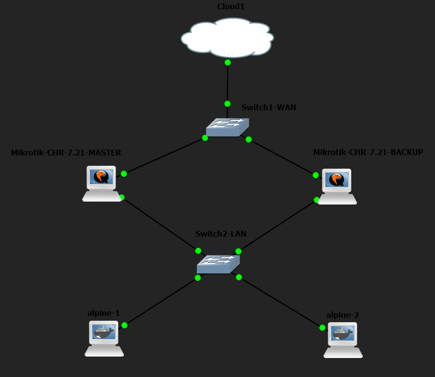

*Figura 1 — Topología en GNS3:* `Cloud1` → `Switch1-WAN` → los dos routers (`Mikrotik-CHR-7.21-MASTER` y `Mikrotik-CHR-7.21-BACKUP`) → `Switch2-LAN` → `alpine-1` y `alpine-2`.

| Nodo | Dispositivo GNS3 | Rol |
|------|------------------|-----|
| Cloud1 | Cloud (NAT) | Da WAN por DHCP a los dos routers |
| Mikrotik-CHR-7.21-MASTER | CHR `chr-7.21.img` | Router — **master** VRRP |
| Mikrotik-CHR-7.21-BACKUP | CHR `chr-7.21.img` | Router — **backup** VRRP |
| Switch1-WAN / Switch2-LAN | ethernet_switch | WAN / LAN (segmento compartido) |
| alpine-1, alpine-2 | Docker `alpine:latest` | Hosts de prueba |

> 💡 La clave del diseño: **los dos routers comparten la misma LAN** (`Switch2-LAN`). VRRP necesita que master y backup estén en el mismo segmento de Capa 2 para poder anunciarse por *multicast*.

---

## 3. Plan de direccionamiento

| Dispositivo | Interfaz | IP | Nota |
|-------------|----------|-----|------|
| R1 (MASTER) | ether9 (WAN) | **DHCP** (Cloud) | obtuvimos `192.168.42.244/24` |
| R1 (MASTER) | ether10 (LAN) | `10.1.2.1/24` | IP real del router |
| R1 (MASTER) | vrrp1 | **`10.1.2.254/32`** | VRID `100` · priority **200** (master) |
| R2 (BACKUP) | ether9 (WAN) | **DHCP** (Cloud) | obtuvimos `192.168.42.2/24` |
| R2 (BACKUP) | ether10 (LAN) | `10.1.2.2/24` | IP real del router |
| R2 (BACKUP) | vrrp1 | **`10.1.2.254/32`** | VRID `100` · priority **100** (backup) |
| alpine-1 | eth0 | `10.1.2.100/24` | gateway `10.1.2.254` |
| alpine-2 | eth0 | `10.1.2.101/24` | gateway `10.1.2.254` |

> 🔑 La IP virtual `10.1.2.254` es el **default gateway** de los hosts. Los hosts **nunca** apuntan a `.1` ni a `.2`: apuntan al "router virtual" que forman ambos equipos.

---

## 4. Paso 1 — Identificar las interfaces reales de cada CHR

Antes de configurar nada, miramos qué interfaces exponía el CHR en GNS3. En los dos routers nos encontramos con `ether9`, `ether10`, `ether11`, `ether12` y `lo`.

```routeros
/interface print
```

*De acá salió la decisión:* usamos **ether9 como WAN** (hacia la nube) y **ether10 como LAN** (hacia `Switch2-LAN`), que es el segmento donde va a correr VRRP.

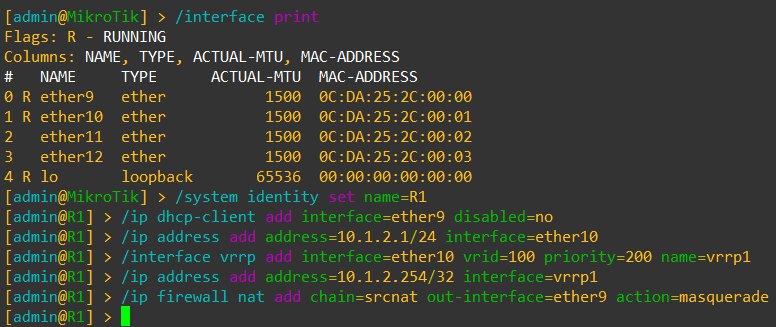

*Figura 2 — R1, primeros comandos:* arriba se ve la salida de `/interface print` (ether9, ether10, ether11, ether12, lo) y, debajo, toda la configuración de R1 ya aplicada.

---

## 5. Paso 2 — Configurar R1 (master)

Aplicamos en R1, en este orden: identidad, cliente DHCP en la WAN, IP de la LAN, la interfaz VRRP, la IP virtual y el NAT.

```routeros
/system identity set name=R1

# WAN — ether9 (Cloud, DHCP)
/ip dhcp-client add interface=ether9 disabled=no

# LAN — ether10 (segmento VRRP)
/ip address add address=10.1.2.1/24 interface=ether10

# VRRP — VRID 100, priority 200 (master)
/interface vrrp add interface=ether10 vrid=100 priority=200 name=vrrp1
/ip address add address=10.1.2.254/32 interface=vrrp1

# NAT — masquerade LAN → WAN (Internet)
/ip firewall nat add chain=srcnat out-interface=ether9 action=masquerade
```


*Figura 3 — Configuración de R1:* se ve el prompt cambiar a `[admin@R1]` tras el `set name=R1`, y cada comando aceptado sin error. La prioridad `200` es lo que lo deja como **master** en la elección.

---

## 6. Paso 3 — Configurar R2 (backup)

R2 lleva exactamente la misma configuración, con dos diferencias: su IP real de LAN es `.2` y su prioridad es `100` (menor que la de R1, por eso queda como **backup**).

```routeros
/system identity set name=R2

# WAN — ether9 (Cloud, DHCP)
/ip dhcp-client add interface=ether9 disabled=no

# LAN — ether10 (segmento VRRP)
/ip address add address=10.1.2.2/24 interface=ether10

# VRRP — VRID 100, priority 100 (backup)
/interface vrrp add interface=ether10 vrid=100 priority=100 name=vrrp1
/ip address add address=10.1.2.254/32 interface=vrrp1

# NAT — masquerade LAN → WAN (Internet)
/ip firewall nat add chain=srcnat out-interface=ether9 action=masquerade
```

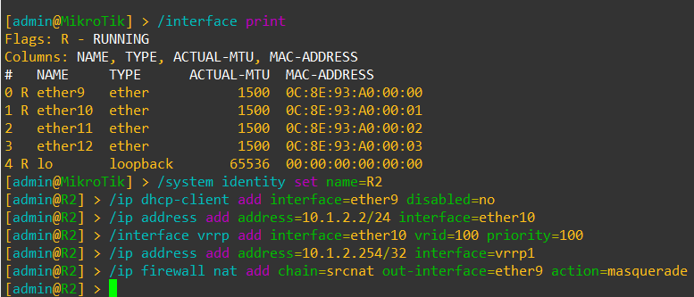

*Figura 4 — Configuración de R2:* mismo set de comandos, con `name=R2`, `10.1.2.2/24` y `priority=100`. El **VRID `100`** y la **IP virtual `10.1.2.254/32` son idénticos** a los de R1: es lo que los hace parte del mismo grupo VRRP.

> ⚠️ El VRID y la IP virtual tienen que coincidir en los dos routers; la **prioridad** es lo único que se diferencia y define quién gana la elección.

---

## 7. Paso 4 — Configurar los hosts Alpine

A los dos hosts les pusimos una IP de la LAN y, como default gateway, **la IP virtual `10.1.2.254`** (no la IP real de ningún router).

**alpine-1:**

```bash
ip addr add 10.1.2.100/24 dev eth0
ip route add default via 10.1.2.254
echo "nameserver 8.8.8.8" > /etc/resolv.conf
```

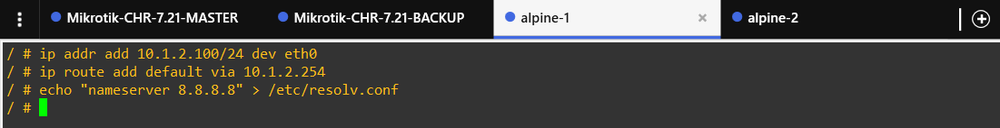

*Figura 5 — Configuración de alpine-1:* IP `10.1.2.100/24`, gateway `10.1.2.254` y DNS `8.8.8.8`.

**alpine-2:**

```bash
ip addr add 10.1.2.101/24 dev eth0
ip route add default via 10.1.2.254
echo "nameserver 8.8.8.8" > /etc/resolv.conf
```

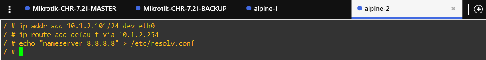

*Figura 6 — Configuración de alpine-2:* IP `10.1.2.101/24`, mismo gateway virtual y mismo DNS.

> 🔑 Fijate que el gateway que escribimos en los hosts es **`.254` (virtual)** y no `.1` ni `.2` (reales). Esa es toda la magia de VRRP: el host apunta a una IP que "no existe" en ningún router físico, pero que siempre responde.

---

## 8. Paso 5 — Verificar el estado (¿Quién es master y quién backup?)

Con la configuración aplicada en los dos routers y antes de tirar nada abajo, consultamos el estado de VRRP y del direccionamiento.

### 8.1 R1 — debería ser MASTER

```routeros
/ip dhcp-client print     → status=bound
/ip address print         → WAN (ether9) + LAN (ether10) + vrrp1
/interface vrrp print     → flag "RM" (running + master)
```

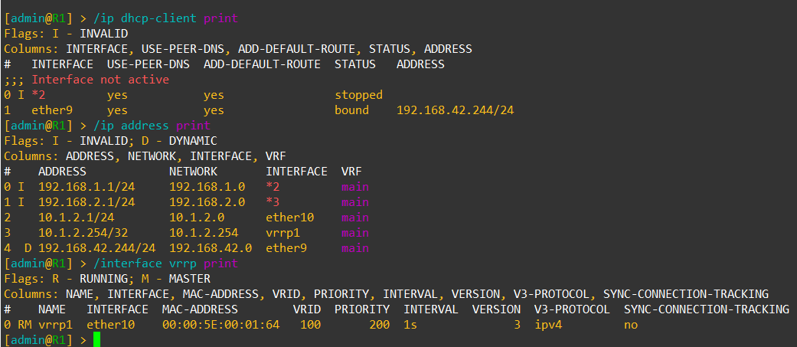

*Figura 7 — Estado de R1:* el `dhcp-client` de `ether9` quedó **`bound`** con `192.168.42.244/24` (WAN). En `ip address print` aparecen la LAN `10.1.2.1/24` (ether10), la VIP `10.1.2.254/32` (vrrp1) y la WAN dinámica. En `interface vrrp print` la línea sale con **flags `R - RUNNING; M - MASTER`** → **R1 es el router virtual activo**, con `vrid=100`, `priority=200` y MAC virtual `00:00:5E:00:01:64`.

### 8.2 R2 — debería ser BACKUP

```routeros
/ip dhcp-client print     → status=bound
/ip address print         → WAN (ether9) + LAN (ether10) + vrrp1
/interface vrrp print     → flag "B" (backup)
```

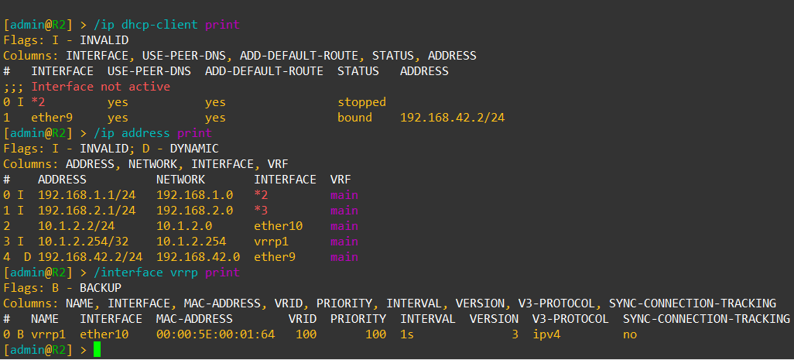

*Figura 8 — Estado de R2:* su WAN quedó en `192.168.42.2/24`, tiene la LAN `10.1.2.2/24` y la misma VIP `10.1.2.254/32`. En `interface vrrp print` los flags son **`B - BACKUP`** → **R2 está en espera**, con `vrid=100` y `priority=100`, escuchando los anuncios del master.

> ✅ Conclusión del paso: **R1 quedó MASTER** (prioridad 200) y **R2 quedó BACKUP** (prioridad 100), ambos con **la misma MAC virtual** `00:00:5E:00:01:64`. Ese resultado es exactamente el esperado.

---

## 9. Paso 6 — Probar conectividad e Internet

Desde `alpine-1` (que tiene como gateway la VIP `10.1.2.254`) probamos tres cosas: llegar a la IP real del router, llegar a la **IP virtual**, y salir a Internet.

```bash
ping -c 4 10.1.2.1       # IP real de R1
ping -c 4 10.1.2.254     # IP VIRTUAL (el gateway)
ping -c 4 8.8.8.8        # salida a Internet
```

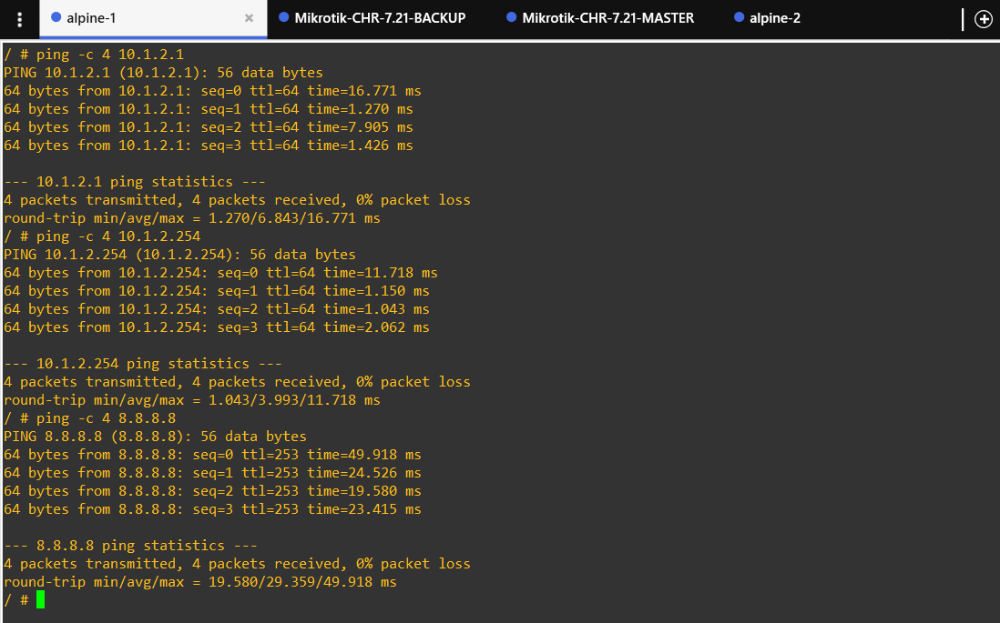

*Figura 9 — Conectividad desde alpine-1:* los tres ping dieron **0% packet loss**. A `10.1.2.1` (real) y a `10.1.2.254` (virtual) responde el mismo equipo (R1, el master); a `8.8.8.8` responde con `ttl=253`, es decir que el paquete **salió a Internet** pasando por el NAT del master.

```bash
traceroute 8.8.8.8
```

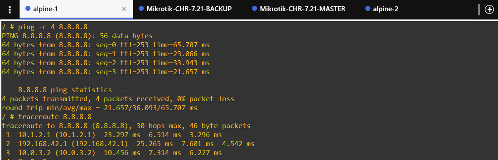

*Figura 10 — Traceroute desde alpine-1:* se ven los saltos `1 → 10.1.2.1` (la LAN de R1), `2 → 192.168.42.1` (el gateway de la nube) y `3 → 10.0.3.2` (ya en Internet). O sea que el host sale por el **master** sin saberlo.

> 🔑 El host nunca "ve" que hay dos routers: usa `10.1.2.254` como gateway y el master responde por él.

---

## 10. Paso 7 — El failover (el momento clave)

Este es el corazón del laboratorio: **simular la caída del gateway** y comprobar que la red no se entera. Para eso, desde la consola de R1 bajamos la interfaz de la LAN (`ether10`), que es la que sostiene el VRRP.

Dejamos un ping continuo a Internet desde un host y, en paralelo, ejecutamos en R1:

```routeros
/interface disable ether10
/interface vrrp print
```

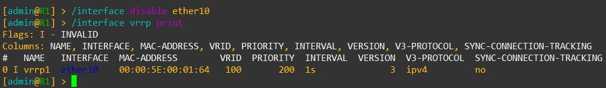

*Figura 11 — R1 al bajar `ether10`:* en cuanto deshabilitamos la interfaz, la línea de VRRP de R1 pasa a **flags `I - INVALID`**. R1 dejó de estar `RUNNING` y, por lo tanto, **dejó de ser master**: ya no puede responder por la IP virtual.

Ahora miramos el otro lado, en R2:

```routeros
/interface vrrp print
```

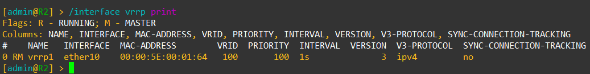

*Figura 12 — R2 asume como master:* R2 ya no está en `BACKUP`, ahora sale con **flags `R - RUNNING; M - MASTER`**. R2 **tomó posesión de la IP virtual** `10.1.2.254` (misma MAC virtual `00:00:5E:00:01:64`, mismo `vrid=100`) y empezó a responder por el gateway.

> ✅ **Qué obtuvimos:** al caer el master, el backup detectó la ausencia de anuncios VRRP y **asumió en pocos segundos**. El host seguía teniendo el mismo gateway (`10.1.2.254`) y el **ping continuo siguió respondiendo** — solo que ahora el tráfico salía por R2. El host **no cambió nada** de su configuración.

---

## 11. Paso 8 — Vuelta a la normalidad (preemption)

Por último, restauramos R1 y verificamos que **recupera** el rol de master, gracias a que tiene mayor prioridad (preemption).

```routeros
/interface enable ether10
/interface vrrp print
```

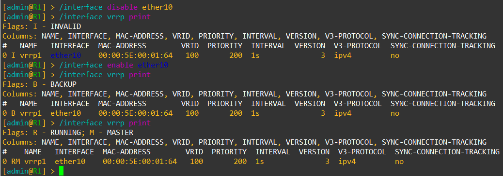

*Figura 13 — Recuperación de R1:* en la captura se ve la secuencia completa. Primero, con `ether10` abajo, el `vrrp print` de R1 marca **`I - INVALID`**. Después, al hacer `enable ether10`, un primer `vrrp print` lo muestra como **`B - BACKUP`** (todavía no reclamó el rol) y, apenas intercambia anuncios, el `vrrp print` final lo devuelve a **`R - RUNNING; M - MASTER`**.

> ✅ **Qué obtuvimos:** R1 **volvió a ser master** (preemption activada por tener `priority=200 > 100`). El gateway virtual quedó de nuevo en manos de R1, sin que los hosts hayan tenido que tocar nada.

---

## 12. ¿Qué está pasando realmente?

- La **MAC virtual** con la que responden los dos routers es `00:00:5E:00:01:64`. Ese valor no es casual: `00:00:5E:00:01:XX` es el prefijo reservado para VRRP y **`0x64 = 100`**, que es justamente el `vrid` que elegimos.
- R1 y R2 responden a **la misma IP** (`10.1.2.254`) y a **la misma MAC** (la virtual). Para el host, "el gateway" es una entidad única, aunque por detrás haya dos equipos.
- El master manda **anuncios VRRP** por *multicast* cada `1 s` (vimos `INTERVAL=1s` en las capturas). El backup los escucha y, si pasan **3 intervalos** sin recibirlos, se declara master.
- Por eso el host **no se entera** de la falla: no cambia su gateway, simplemente cambia **quién** responde por IP/MAC virtuales.

> 💡 Dato de la ejecución: en nuestras capturas la interfaz VRRP quedó en **`VERSION 3` / `V3-PROTOCOL ipv4`**, que es el comportamiento por defecto de RouterOS 7. Si en el proyecto grupal se quisiera usar **autenticación simple (VRRPv2)** como en la memoria (`/interface vrrp set [find vrid=10] version=2 authentication=simple password=<VRRP_KEY_10>`), hay que **forzar `version=2`**, porque la autenticación de VRRP solo existe en la v2.

---

## 13. ⚠️ La limitación que nos llevamos (el gotcha)

VRRP **solo** hace failover cuando cae el **enlace LAN** (`ether10`), que es donde corren los anuncios. Si en cambio cae el **WAN del master** (`ether9`) pero su LAN sigue viva:

- R1 **sigue siendo master** (su `ether10` sigue `RUNNING`).
- Los hosts siguen mandando al gateway virtual… y **se quedan sin Internet**, aunque R2 esté sano y con su WAN funcionando.

> **Conclusión:** VRRP cubre la caída del *gateway*, no la del *uplink*. Para la caída del enlace WAN hace falta **tracking** (en MikroTik, un `/tool netwatch` o `check-gateway` que baje la prioridad de la interfaz VRRP cuando el WAN no responde). Ese es el caso de la **Capa 2 del mapa de failover** que seguimos en el proyecto grupal.

---

## 14. Conclusiones del grupo

1. **Funciona:** con R1 (prio 200) y R2 (prio 100) en el mismo VRID conseguimos un gateway virtual redundante.
2. **Es transparente:** los hosts solo conocen `10.1.2.254`; nunca supieron que existía R2 hasta que R1 cayó.
3. **El failover es rápido:** la toma de control se resolvió en pocos segundos y el ping continuo no se cortó.
4. **La vuelta es automática:** con prioridad mayor, R1 reclamó el rol master apenas volvió (preemption).
5. **Tiene un límite claro:** sin *tracking*, VRRP no cubre la caída del enlace de subida.

---

## 15. Preguntas de reflexión

### 15.1 ¿Por qué el host apunta a `10.1.2.254` y no a `10.1.2.1`?

El host debe apuntar a la **IP virtual** (`10.1.2.254`) porque es la dirección que **comparten** los routers que participan del grupo VRRP. Si el host apuntara a la **IP física** de uno de los routers (como `10.1.2.1`), perdería conectividad si ese router específico fallara, eliminando el propósito de la redundancia de primer salto. Al usar la IP virtual, el host **no necesita enterarse** de qué router físico está procesando realmente el tráfico, lo que permite un failover transparente.

### 15.2 ¿Qué pasa con la MAC virtual durante el failover? ¿Cambia?

La **MAC virtual no cambia** durante el failover. Tanto el master como el backup están configurados para responder a la **misma combinación de IP virtual y MAC virtual** (en este caso `00:00:5E:00:01:64` para el VRID 100). Cuando ocurre el failover, el nuevo master simplemente asume la responsabilidad de procesar el tráfico dirigido a esa MAC, manteniendo la continuidad para los hosts **sin que tengan que actualizar sus tablas ARP**.

### 15.3 ¿Cuál es la diferencia con HSRP?

La diferencia principal está en su **origen y compatibilidad**: VRRP (RFC 5798) es un **estándar abierto** de la IETF, lo que permite la interoperabilidad entre equipos de distintos fabricantes (*multi-vendor*). HSRP (RFC 2281) es un protocolo **propietario de Cisco** y, por lo tanto, solo funciona de forma nativa entre dispositivos de esa marca. Además, usan **direcciones MAC virtuales distintas**: VRRP usa `00-00-5E-00-01-VRID` (en nuestro lab, `00:00:5E:00:01:64`), mientras que HSRP usa `00-00-0C-07-AC-XX`.

### 15.4 ¿Qué limitación tiene VRRP solo, y cómo la resolverías?

VRRP por sí solo **únicamente detecta y responde a fallas en la interfaz local** donde está operando (la LAN, en este caso). Si un router master pierde su conexión hacia el exterior (el *uplink* / WAN) pero su interfaz LAN sigue activa, **continuará operando como master** y recibiendo el tráfico de los hosts, dejándolos **sin salida a Internet** (efecto de *agujero negro*). Para resolverlo hay que implementar mecanismos de **tracking** (como `check-gateway` en MikroTik, o IP SLA con *object tracking* en Cisco) que monitoreen el estado del enlace externo y, si este falla, **decrementen la prioridad VRRP del master** para forzar la conmutación al backup.

---

## 📎 Referencias

- Guía base del laboratorio: [`laboratorio-vrrp.md`](laboratorio-vrrp.md)
- [Router Redundancy — VRRP Mikrotik (Step by Step)](https://youtu.be/h_r9FtR8ZUk) — Arawi Network Consulting
- [VRRP Explained](https://youtu.be/Kl3jSFbVMTE) — NetWorks
- RFC 5798 — Virtual Router Redundancy Protocol (VRRP) v3
- RFC 2281 — Cisco HSRP
- MikroTik Wiki: [VRRP Configuration Examples](https://help.mikrotik.com/docs/spaces/ROS/pages/128221211/VRRP+Configuration+Examples)

---

### 📁 Índice de capturas

| Figura | Archivo | Paso |
|:------:|---------|------|
| 1 | `images/topologia.png` | Paso 0 — Topología |
| 2 | `images/configuracionR1.png` | Paso 1 — Interfaces / Paso 2 — Config R1 |
| 3 | `images/configuracionR1.png` | Paso 2 — Config R1 (master) |
| 4 | `images/configuracionR2.png` | Paso 3 — Config R2 (backup) |
| 5 | `images/configuracionAlpine1.png` | Paso 4 — Host alpine-1 |
| 6 | `images/configuracionAlpine2.png` | Paso 4 — Host alpine-2 |
| 7 | `images/verificarEstadoR1.png` | Paso 5 — Estado R1 (MASTER) |
| 8 | `images/verificarEstadoR2.png` | Paso 5 — Estado R2 (BACKUP) |
| 9 | `images/conectividadEInternet.png` | Paso 6 — Conectividad e Internet |
| 10 | `images/traceroute.png` | Paso 6 — Traceroute |
| 11 | `images/failover1.png` | Paso 7 — R1 cae (INVALID) |
| 12 | `images/failover2.png` | Paso 7 — R2 asume (MASTER) |
| 13 | `images/deVueltaALaNormalidad.png` | Paso 8 — Vuelta a la normalidad |

